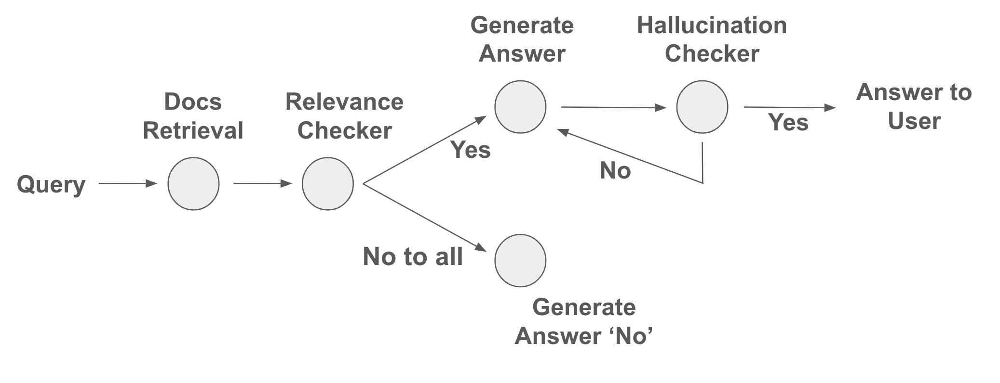

## 3일차 수업
https://docs.google.com/presentation/d/1VvmrljOG-3l6ggNWpfsm0C2oVH-lzJqE8JRJ8fU9zbY/edit#slide=id.g2ef5b8b5c89_78_646

## 실습 프로젝트

### 실습 자료
https://colab.research.google.com/drive/1rwTzRRa8QmuTUA9kgy8Y4-QnN5G_x-dn?usp=drive_link#scrollTo=g6QlQjnMqoOA

### 목표


### how to install langchain (v0.3)
https://python.langchain.com/docs/how_to/installation/

### 요구사항
1. 3개의 블로그 포스팅 본문을 Load하기 : WebBaseLoader 활용
2. 불러온 본문을 Split (Chunking) : recursive text splitter 활용 (아래 링크 참고)
3. Chunks 를 임베딩하여 Vector store 저장: openai 임베딩, chroma vectorstore 사용
4. User query = ‘agent memory’ 를 받아 관련된 chunks를 retrieve
5. 5-1) 과 5-2) 를 참고하여, User query와 retrieved chunk 에 대해 relevance 가 있는지를 평가하는 시스템 프롬프트를 작성해보세요: retrieval 퀄리티를 LLM 이 스스로 평가하도록 하고, 관련이 있으면 {‘relevance’: ‘yes’} 관련이 없으면 {‘relevance’: ‘no’} 라고 출력하도록 함. ( JsonOutputParser() 를 활용 )
6. 5 에서 모든 docs에 대해 'yes' 가 나와야 하는 케이스와 ‘no’ 가 나와야 하는 케이스를 작성해보세요.
7. 5에서 케이스별로 의도한 결과 ('yes' 또는 'no' )와 일치하는 답변이 나오는지 확인해보세요. 정답대로 나오지 않는다면 문제를 찾아 디버깅해보세요. (Splitter, Chunk size, overlap, embedding model, vector store, retrieval 평가 시스템 프롬프트 등) 디버깅이 어려운 경우, 강사/조교에게 질문해주세요.
8. 6-7 의 평가에서 문제가 없다면, 5에서 작성한 코드의 실행 결과가 'yes' 인 경우, 4의 retrieved chunk 를 가지고 답변하는 chain 코드를 작성해주세요. (prompt | llm | parser 형태의 코드)
9. 생성된 답안에 Hallucination 이 있는지 평가하는 시스템 프롬프트를 작성해보세요. LLM이 스스로 평가하도록 하고, hallucination 이 있으면 {‘hallucination’: ‘yes’} 없으면 {‘hallucination’: ‘no’} 라고 출력하도록 하세요.
10. 9 에서 ‘yes’ 면 8 로 돌아가서 다시 생성, ‘no’ 면 답변 생성하고 유저에게 답변 생성에 사용된 출처와 함께 출력하도록 하세요. (최대 1번까지 다시 생성)


### WebBaseLoader
[Document Loader](https://python.langchain.com/api_reference/community/document_loaders/langchain_community.document_loaders.web_base.WebBaseLoader.html)
```shell
pip install -U langchain_community bs4
```

### RecursiveCharacterTextSplitter
https://python.langchain.com/api_reference/text_splitters/character/langchain_text_splitters.character.RecursiveCharacterTextSplitter.html#recursivecharactertextsplitter
https://python.langchain.com/docs/tutorials/rag/